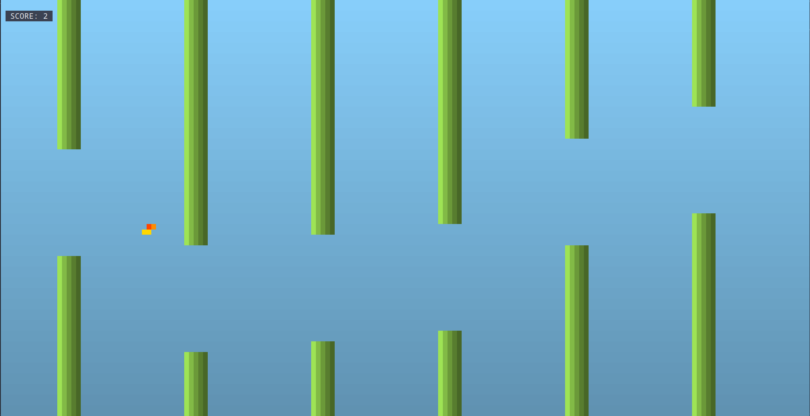

# RusTTY Bird 🐦‍🔥

A lightweight, high-performance terminal-based Flappy Bird clone written in **Rust**.



---

## 🏗️ Architecture & Libraries

`RusTTY Bird` uses a classic game loop architecture structured across individual module components:

* **`crossterm`**: The core terminal manipulation library used for handling raw input events (keyboard space/jump inputs), terminal resizing, cursor hiding, and cross-platform color rendering.
* **`rand`**: Used inside the pipe mechanics to dynamically generate variable pipe gap heights.

---

## 🛠️ Requirements

### To Run the Pre-compiled Binary
* **Operating System**: Windows, macOS, or Linux.
* **Terminal Emulator**: A modern terminal emulator with true color (24-bit RGB) support and support for ANSI escape codes (e.g., Alacritty, Kitty, iTerm2, Windows Terminal, or GNOME Terminal). 
* **Permissions**: Executable permissions granted to the binary file (`chmod +x`).

### To Build and Run From Source
* **Rust Toolchain**: Stable Rust installation (Compiler `rustc` and package manager `cargo`). It is recommended to use **Rust 1.70.0** or newer due to dependencies.
* **Dependencies (Handled automatically by Cargo)**:
  * `crossterm` (v0.27 or newer) — For terminal raw mode, drawing primitives, and cross-platform input event handling.
  * `rand` (v0.9 or newer) — For generating the dynamic pipe gap positions.
* **C Linker**: A valid local C linker installed on your system framework (e.g., `cc`, `gcc`, `clang`, or MSVC Build Tools) to finalize compilation.

---

## 🚀 How to Run the Game

### Method 1: Download the Pre-compiled Binary (Quickest)

You do not need Rust installed on your system to play the game.

1. Navigate to the **Releases** section on the right side of this GitHub repository page.
2. Download the latest compiled executable binary compatible with your Operating System (e.g., Windows, macOS, or Linux).
3. Open your terminal or command prompt, navigate to your downloads folder, and execute the file:
```bash
# Linux/macOS
chmod +x RusTTY_Bird_Linux
./RusTTY_Bird_Linux

# macOS
chmod +x RusTTY_Bird_macOS
./RusTTY_Bird_macOS

# Windows
.\RusTTY_Bird_Windows.exe
```

### Method 2: Build and Run from Source

If you have the Rust toolchain installed, you can easily compile and run the project locally.

1. Clone the repository:

```bash
git clone [https://github.com/yourusername/RusTTY_Bird.git](https://github.com/yourusername/RusTTY_Bird.git)
cd RusTTY_Bird
```

2. Run the game using Cargo:
> Cargo will automatically fetch the dependencies and run the application in a unified step:

```bash
cargo run --release
```

---

## 🎮 Controls

- `Spacebar` or `Enter` — Jump
- `Q` or `Esc` — Quit Game
- `Ctrl + C` — Force Exit
